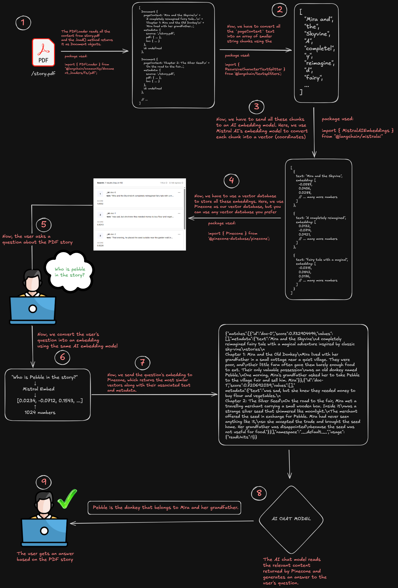

# Retrieval-Augmented Generation (RAG)

A simple implementation of a Retrieval-Augmented Generation (RAG) pipeline using **LangChain, Mistral AI Embeddings, and Pinecone**.

This project demonstrates how a PDF document can be processed, split into smaller chunks, converted into embeddings, stored in a vector database, and searched using a user's question.

## 🧠 RAG Workflow

PDF → PDFLoader → Text Splitting → Chunks → Mistral Embeddings → Pinecone → User Question → Question Embedding → Pinecone Similarity Search → Relevant Chunks



## 📁 Project Structure

- `src/.env` — Stores API keys locally. This file is ignored by Git.
- `src/.env.example` — Example environment file showing the required environment variables.
- `src/ingest.js` — Handles the PDF ingestion and stores embeddings in Pinecone.
- `src/query.js` — Converts a user's question into an embedding and searches Pinecone.
- `story.pdf` — Sample PDF used for this project.
- `rag-pipeline.png` — Visual representation of the RAG workflow.
- `.gitignore` — Specifies files that should not be committed to Git.
- `package.json` — Contains project dependencies and configuration.
- `package-lock.json` / `yarn.lock` — Lock dependency versions.
- `README.md` — Project documentation.

## 📥 Ingestion Process — `ingest.js`

The `ingest.js` file handles the process of taking a PDF and storing its embeddings in Pinecone.

The process is:

1. `PDFLoader` reads the PDF and returns its content as LangChain `Document` objects.
2. The `pageContent` from the documents is extracted.
3. `RecursiveCharacterTextSplitter` converts the text into smaller chunks.
4. Each chunk is sent to Mistral's `mistral-embed` model.
5. Mistral converts each chunk into a vector containing numerical values.
6. The generated embeddings and their associated text are uploaded to Pinecone.
7. Pinecone stores these vectors so they can later be searched.

The text splitter currently uses:

- `chunkSize: 500`
- `chunkOverlap: 0`

## 🔎 Query Process — `query.js`

The `query.js` file handles searching the embeddings that have already been stored in Pinecone.

The process is:

1. The user asks a question about the PDF.
2. The question is converted into an embedding using the same `mistral-embed` model.
3. The question embedding is sent to Pinecone.
4. Pinecone performs a similarity search against the stored vectors.
5. The most similar results are returned along with their associated text and metadata.

For example, a question such as **"Who is Pebble in the story?"** is converted into an embedding and searched against the embeddings stored in Pinecone.

## 🤖 Embeddings

An embedding converts text into a numerical vector that represents the meaning of the text.

For example:

`"Mira lived with her grandfather..."`

becomes something like:

`[0.02, -0.13, 0.45, ...]`

The project uses Mistral's `mistral-embed` model to generate these embeddings.

The same embedding model is used for both:

- PDF text chunks
- User questions

This allows the document vectors and query vectors to exist in the same embedding space for similarity search.

## 🗄️ Pinecone

Pinecone is used as the vector database in this project.

The generated embeddings are stored in Pinecone along with their associated text. When a user asks a question, the question's embedding is compared against the stored embeddings to find the most relevant content.

## 🔑 Environment Variables

Create a `.env` file inside the `src` folder:

```env
MISTRAL_API_KEY=YOUR_MISTRAL_API_KEY
PINECONE_API_KEY=YOUR_PINECONE_API_KEY
```

A `.env.example` file is included with the same variables as a template.

The actual `.env` file should never be committed to GitHub because it contains secret API keys.

## 📦 Technologies Used

- Node.js
- LangChain
- Mistral AI
- Pinecone
- PDFLoader
- RecursiveCharacterTextSplitter

### Main Packages

- `@langchain/community`
- `@langchain/textsplitters`
- `@langchain/mistralai`
- `@pinecone-database/pinecone`
- `dotenv`

## ⚙️ Setup

### 1. Clone the repository

```bash
git clone <your-repository-url>
cd Retrieval-Augmented-Generation
```

### 2. Install dependencies

This project can be installed using either **npm** or **Yarn**.

#### Using npm

```bash
npm install
```

If `npm install` results in dependency or peer-dependency errors, you can use Yarn instead.

#### Using Yarn

```bash
npx yarn
```

Or, if Yarn is already installed globally:

```bash
yarn
```

If Yarn is not installed, you can install it using:

```bash
npm install -g yarn
```

Then run:

```bash
yarn
```

### 3. Configure environment variables

Create:

```text
src/.env
```

and add:

```env
MISTRAL_API_KEY=YOUR_MISTRAL_API_KEY
PINECONE_API_KEY=YOUR_PINECONE_API_KEY
```

You can use `src/.env.example` as a template.

### 4. Add your PDF

Place the PDF you want to process in the project root and update the PDF path in `src/ingest.js` if required.

For example:

```js
const loader = new PDFLoader("./story.pdf")
```

## 🚀 Running the Project

### Step 1 — Ingest the PDF

Run:

```bash
node src/ingest.js
```

This will:

- Load the PDF
- Extract its text
- Split the text into smaller chunks
- Generate embeddings using Mistral AI
- Store the embeddings and associated text in Pinecone

The ingestion process does not need to be run every time a question is asked. It only needs to be run when adding a new document or re-indexing an existing document.

### Step 2 — Query the stored embeddings

Run:

```bash
node src/query.js
```

This will:

- Convert the user's question into an embedding
- Send the embedding to Pinecone
- Search for the most similar stored vectors
- Return the relevant content and metadata

## 🔄 Why Are There Two Files?

The project separates the **ingestion** and **query** processes.

### Ingestion

```text
ingest.js
    ↓
PDF → Chunks → Embeddings → Pinecone
```

This process prepares and stores the document data.

### Query

```text
query.js
    ↓
Question → Embedding → Pinecone Search
```

This process searches the embeddings that were already stored in Pinecone.

Separating these processes prevents the PDF from being processed and uploaded to Pinecone every time a new question is asked.

## 🔍 Understanding the Important Concepts

### What is a Chunk?

A chunk is a smaller piece of the original document.

For example:

```text
Large PDF
   ↓
Chunk 1
Chunk 2
Chunk 3
Chunk 4
...
```

The project uses `RecursiveCharacterTextSplitter` to split the document into smaller chunks.

The current configuration is:

```js
chunkSize: 500,
chunkOverlap: 0
```

### What is an Embedding?

An embedding converts text into a numerical vector that represents the meaning of that text.

For example:

```text
"Mira lived with her grandfather..."
              ↓
        Mistral Embed
              ↓
[0.02, -0.13, 0.45, ...]
```

These vectors allow us to perform similarity-based searches.

### What is Pinecone?

Pinecone is a vector database.

It stores the generated embeddings and allows us to search for vectors that are semantically similar to a given query.

## 📌 Current Project Scope

This project currently covers the core **document ingestion and retrieval** part of a RAG pipeline:

```text
PDF
 ↓
Load
 ↓
Split
 ↓
Embed
 ↓
Store in Pinecone
 ↓
User Question
 ↓
Embed Question
 ↓
Similarity Search
 ↓
Retrieve Relevant Content
```

The next step would be to send the relevant content returned by Pinecone to an AI chat model, which can read that content and generate the final answer for the user.

## 🎯 What I Learned

- How PDF document loading works
- How `pageContent` is extracted
- How text chunking works
- How `chunkSize` and `chunkOverlap` work
- How embeddings represent text as vectors
- How to generate embeddings using Mistral AI
- How vector databases work
- How to store embeddings in Pinecone
- How similarity search works
- Why the same embedding model should be used for documents and queries
- How to separate document ingestion from querying
- The basic architecture of a RAG pipeline